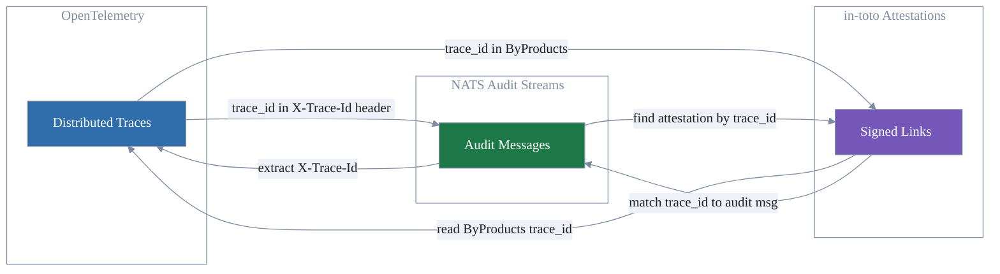
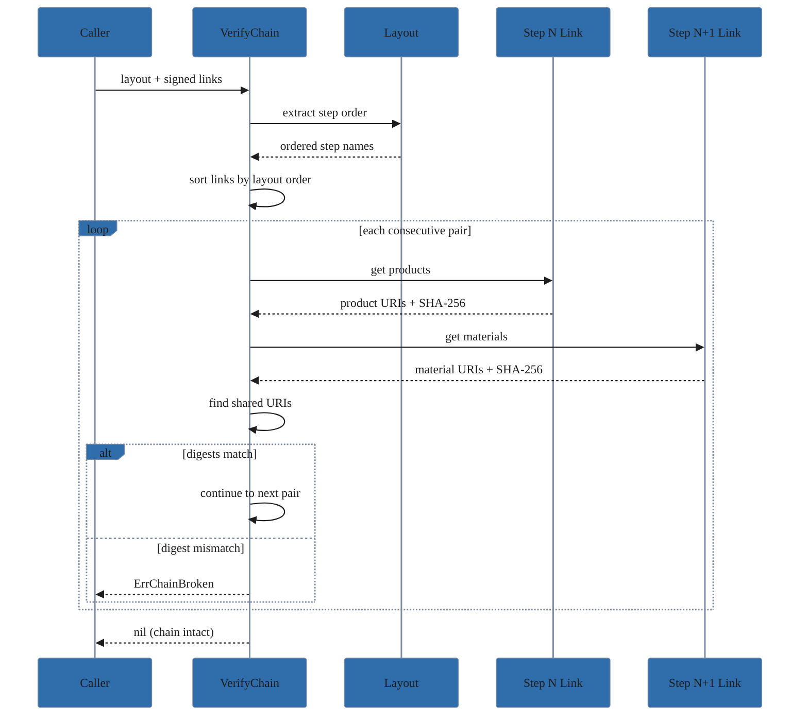

# Cryptographic Attestation

This document covers the in-toto attestation system for compliance audit trails, its integration with OpenTelemetry traces and NATS audit streams, and the current implementation status.

> **Status**: The `pkg/attestation` package is fully implemented. It provides in-toto attestation generation, verification (layouts, links, and hash chains), FIPS algorithm enforcement, enriched byproducts, and manifest generation, all backed by in-toto-golang v0.11.0 with automatic OTel trace correlation.

## Overview

CrossCodex uses [in-toto](https://in-toto.io/) attestations to provide cryptographic proof of every compliance-critical operation. An auditor should be able to verify that a compliance mapping was produced by a specific model, from specific input materials, at a specific time, and trace that attestation back to the full distributed trace of the operation.

Three systems work together:

1. **OpenTelemetry traces** record what happened and when (see [Telemetry](telemetry.md)).
2. **NATS audit streams** persist the operational record with integrity guarantees (see [Audit Streams](audit-streams.md)).
3. **in-toto attestations** provide cryptographic proof that each step was performed by an authorized process with the expected inputs and outputs.

The bridge between these systems is the OTel trace ID. Every attestation embeds the trace ID of the operation it attests to, and every audit message carries the same trace ID in its provenance headers. An auditor can start from any of the three systems and reach the other two.

## In-Toto Concepts

### Layouts

A layout defines the expected supply chain workflow — which steps should execute, in what order, and who is authorized to perform each step. In CrossCodex, the Pipeline service signs the layout declaring the authorized stages and functionaries for a compliance processing run.

### Links

A link is an execution record for a single step. It captures:

- **Materials**: input artifacts with their SHA-256 digests (e.g., the OSCAL catalog being analyzed)
- **Products**: output artifacts with their digests (e.g., the generated compliance mapping)
- **Command**: what was executed
- **By-products**: additional metadata, including the OTel trace ID, span ID, timestamp, and hostname

### Verification

Given a layout and a set of links, verification confirms that every declared step was performed by an authorized functionary, that the chain of materials-to-products is unbroken (hash chain verification), and that all signatures are valid.

## Package Structure

The `pkg/attestation` package defines the following:

### Generator Interface

```go
type Generator interface {
    CreateLayout(ctx context.Context, opts LayoutOptions) (*SignedLayout, error)
    CreateLink(ctx context.Context, step string, materials, products []Artifact, opts ...LinkOption) (*SignedLink, error)
    Verify(ctx context.Context, data []byte) (*VerifiedLink, error)
    VerifyLayout(ctx context.Context, data []byte) (*VerifiedLayout, error)
    VerifyChain(ctx context.Context, layout *SignedLayout, links []*SignedLink) error
}
```

### Key Providers

| Type                   | Purpose                                                                 |
|------------------------|-------------------------------------------------------------------------|
| `KeyProvider`          | Interface: `SigningKey`, `VerificationKey`, `KeyID` methods             |
| `FileKeyProvider`      | Loads ECDSA P-256 keys from PEM files on disk                           |
| `EphemeralKeyProvider` | Generates in-memory ECDSA P-256 keys (for embedded/TLS-off mode, tests) |

### Types

| Type             | Purpose                                                                    |
|------------------|----------------------------------------------------------------------------|
| `LayoutOptions`  | Layout creation parameters: steps, inspections, expiry duration            |
| `Step`           | Pipeline step with expected materials, products, command, and threshold    |
| `Inspection`     | Post-execution verification (run command, check success criteria)          |
| `Artifact`       | File or artifact with URI and SHA-256 digest                               |
| `SignedLayout`   | Signed layout envelope (raw bytes + expiry time)                           |
| `SignedLink`     | Signed link envelope (raw bytes, step name, trace ID, materials, products) |
| `VerifiedLayout` | Verified layout result (steps, inspections, expiry, key IDs)               |
| `VerifiedLink`   | Verified link result (step, materials, products, byproducts map)           |
| `LinkOption`     | Functional option for per-call link customization                          |

### Options

| Option                           | Purpose                                                         |
|----------------------------------|-----------------------------------------------------------------|
| `WithTelemetry(tracer, meter)`   | Enables OTel span emission and metrics recording                |
| `WithFIPSMode(enabled)`          | Enforces FIPS-approved algorithms (ECDSA P-256/384/521 only)    |
| `WithIncludeByProducts(enabled)` | Enriches links with span_id, timestamp, and hostname            |
| `WithByProducts(extra)`          | Per-call LinkOption to inject additional byproducts into a link |

### Errors

| Error                   | Meaning                                                  |
|-------------------------|----------------------------------------------------------|
| `ErrInvalidLayout`      | The layout is malformed or missing required fields       |
| `ErrSignatureFailed`    | Signing the attestation payload failed                   |
| `ErrVerificationFailed` | Signature verification did not pass                      |
| `ErrExpired`            | The layout has expired (VerifyLayout checks expiry)      |
| `ErrKeyNotFound`        | Key file not found at specified path                     |
| `ErrKeyLoadFailed`      | Key file exists but cannot be parsed                     |
| `ErrNonFIPSAlgorithm`   | Key uses non-FIPS algorithm (FIPS mode enforcement)      |
| `ErrChainBroken`        | Hash chain verification failed between consecutive steps |

### Standalone Functions

| Function           | Purpose                                                         |
|--------------------|-----------------------------------------------------------------|
| `GenerateManifest` | Creates SHA-256 manifest in GNU coreutils format, sorted by URI |

## Configuration

The `AttestationConfig` in `pkg/config` controls attestation behavior:

```yaml
attestation:
  enabled: true                    # Master enable/disable
  private_key_path: ""             # Path to ECDSA signing key PEM (empty = ephemeral)
  public_key_path: ""              # Path to SPKI verification key PEM (empty = ephemeral)
  expiry_duration: 8760h           # Layout expiry (default: 1 year)
  include_byproducts: true         # Add span_id, timestamp, hostname to links
  tenant_overrides:                # Per-tenant overrides
    sensitive-tenant:
      enabled: true
      private_key_path: ""         # Override signing key (empty = use global)
      public_key_path: ""          # Override verification key (empty = use global)
      expiry_duration: 4380h       # Shorter expiry for this tenant
      include_byproducts: false    # Strip environment metadata
```

The `ForTenant(tenantID)` method resolves per-tenant overrides with nil-pointer inheritance (nil = use global default) and returns an `AttestationTenantConfig` struct containing the resolved `Enabled`, `PrivateKeyPath`, `PublicKeyPath`, `ExpiryDuration`, and `IncludeByProducts` values.

When both `private_key_path` and `public_key_path` are empty, the system uses `EphemeralKeyProvider` to generate in-memory keys. When both are set, `FileKeyProvider` loads from disk. Having one set but not the other is a validation error. Per-tenant overrides follow the same pairing rule.

## Attestation-Trace Bridge



Every attestation embeds the OTel trace ID from the active span context. The `CreateLink` method automatically injects `ByProducts["trace_id"]` via `telemetry.TraceIDFromContext(ctx)`. When `WithIncludeByProducts(true)` is set, additional metadata is included:

- `span_id` — current span ID via `telemetry.SpanIDFromContext(ctx)`
- `timestamp` — UTC time in RFC3339 format
- `hostname` — machine hostname via `os.Hostname()`

The proto field `AuditMetadata.correlation_id` (defined in `api/proto/crosscodex/v1/common.proto`) is documented as "OpenTelemetry trace ID" and serves the same bridging purpose at the protobuf layer.

## Verification Pipeline

### Layout Verification (`VerifyLayout`)

Deserializes a signed layout envelope, verifies the signature against the provider's verification key, checks expiry against the current time (returns `ErrExpired` if past), and returns a `VerifiedLayout` with the extracted steps, inspections, expiry time, and signer key IDs.

### Link Verification (`Verify`)

Deserializes a signed link envelope, verifies the signature, and returns a `VerifiedLink` with the step name, materials, products, and byproducts map (including trace_id).

### Chain Verification (`VerifyChain`)



Given a layout and a set of signed links, verifies that the hash chain between consecutive steps is unbroken. For each consecutive pair of steps, shared URI artifacts (where step N's product URI matches step N+1's material URI) must have identical SHA-256 digests. If a layout is provided, links are sorted by layout step order before verification. Returns `ErrChainBroken` with the step names and mismatched artifact URI on failure.

### FIPS Mode (`WithFIPSMode`)

When enabled, validates that all signing keys use FIPS-approved algorithms (ECDSA with P-256, P-384, or P-521 curves). Non-ECDSA keys or unsupported curves are rejected with `ErrNonFIPSAlgorithm`. The check runs at both `CreateLayout` and `CreateLink` time.

## Storage Paths

Attestation artifacts are stored at two complementary path types:

### Job-Structured Paths (Discoverability)

`storage.JobAttestationKey(jobID, filename)` generates paths like:
- `jobs/<jobID>/attestation/layout.json`
- `jobs/<jobID>/attestation/<step>.link.json`
- `jobs/<jobID>/attestation/input_manifest.sha256`

### Content-Addressed Paths (Integrity)

`storage.ContentKey(data)` generates paths like:
- `attestation/<sha256-hash>.json`

Both paths store the same artifact. Job-structured paths enable browsing by job; content-addressed paths enable integrity verification (the key itself proves the content hasn't been modified).

Tenant prefixing is handled by the storage `Provider` layer, not by the key generation functions.

## DAG-to-Layout Bridge

The `internal/pipeline/attestation` package provides a `Converter` that transforms an `analyzer.DAG` into `attestation.LayoutOptions`:

- Each analyzer becomes a `Step`
- `Step.Name` = analyzer name
- `Step.ExpectedMaterials` = product names of dependencies (`<dep>.output`)
- `Step.ExpectedProducts` = `[<name>.output]`
- `Step.Threshold` = 1 (single signer per step)
- Steps are ordered by DAG topological order
- `ExpiresIn` is NOT set by the converter — the caller wires it from `AttestationConfig.ExpiryDuration`

This adapter keeps `pkg/attestation` and `pkg/analyzer` decoupled.

## Operations Requiring Attestations

Four categories of compliance-critical operations must generate attestations when the services are implemented:

| Operation         | Service              | What the Attestation Proves                                    |
|-------------------|----------------------|----------------------------------------------------------------|
| Catalog ingestion | Ingestion Service    | OSCAL document authenticity, validation result, source hash    |
| Control mappings  | Analysis / Synthesis | AI-generated mapping accuracy, model used, input/output hashes |
| Risk assessments  | Analysis Service     | Evaluation results, evidence collected, criteria applied       |
| Policy violations | (enforcement)        | Actions taken, audit trail, affected controls                  |

## Reading Attestations

An auditor verifying a compliance determination would:

1. Find the compliance decision in the `AUDIT_DECISIONS` NATS stream.
2. Extract the `X-Trace-Id` provenance header to get the trace ID.
3. Search object storage for attestation bundles that reference that trace ID (job-structured paths for browsing, content-addressed for verification).
4. Verify the layout signature via `VerifyLayout`.
5. Verify each link signature via `Verify`.
6. Verify the hash chain via `VerifyChain`.
7. Confirm the manifest matches expected input artifacts.
8. Optionally, view the full trace in Jaeger using the same trace ID to see timing, service interactions, and error details.

## Remaining Work

- **Service implementations**: The internal services (`internal/ingestion`, `internal/catalog`, `internal/analysis`, `internal/synthesis`) that would call the attestation API.
- **`AuditMetadata.correlation_id` population**: Each service must set this field from `telemetry.TraceIDFromContext(ctx)` when constructing protobuf messages.
- **Verification CLI**: A `crosscodex verify` command that takes a compliance report and validates the attestation chain. The `pkg/attestation` API is ready; the CLI is a thin wrapper.

## Security Considerations

- Attestation signing keys must be protected. Use `pkg/tlsconfig/pki` for key generation in development and a proper key management system (HSM, Vault) in production. The `EphemeralKeyProvider` is for embedded/test use only.
- When `WithFIPSMode(true)` is set, only ECDSA P-256/384/521 keys are accepted. This is enforced at signing time, not just configuration time.
- The attestation chain depends on the integrity of the OTel trace ID. If trace context is dropped or spoofed, the link between the attestation and the operational record is broken. TLS transport encryption and provenance header validation (enforced by `pkg/natsbus`) mitigate this.
- Layouts define who is authorized to perform each step. A compromised signing key allows unauthorized attestations. Key rotation and revocation procedures should be defined before production deployment.
- Attestation bundles stored in object storage are content-addressed (keyed by hash), making them immutable. Deleting an attestation requires deleting the storage object, which should be restricted to platform administrators.
