# Backup and Restore

This document covers how `pkg/backup` and `crosscodexd admin backup` work internally: the capture pipeline, the manifest format, the consistency model, and the design decisions behind them. For operating procedures (enabling backup, running it, restoring), see [deploy/README.md, Backups](../../deploy/README.md#backups).

## Architecture

`admin backup run` captures the three stores in a fixed order — Postgres first, then objects, then JetStream — under a shared advisory lock, and commits the point by writing its manifest last:

```mermaid
%%{init: {'theme': 'base', 'themeVariables': {
  'primaryColor': '#2f6dab',
  'primaryTextColor': '#1e1e1e',
  'primaryBorderColor': '#7c8ba1',
  'lineColor': '#7c8ba1',
  'edgeLabelBackground': '#eef2f8',
  'tertiaryColor': 'transparent',
  'tertiaryTextColor': '#7c8ba1',
  'tertiaryBorderColor': '#7c8ba1',
  'clusterBkg': 'transparent',
  'clusterBorder': '#7c8ba1',
  'titleColor': '#7c8ba1',
  'noteBkgColor': '#eef2f8',
  'noteTextColor': '#1e1e1e',
  'fontFamily': 'system-ui, sans-serif'
}, 'themeCSS': '.node .nodeLabel{color:#ffffff!important;fill:#ffffff!important;}'}}%%
flowchart LR
  run(["admin backup run"]) --> lock{{"advisory lock\ncrosscodex:backup-retention"}}
  lock --> pg["Postgres\nwal-g backup-push (remote BASE_BACKUP)"]
  pg --> obj["Objects\nTenantLister → ObjectStoreOpener → blob repo"]
  obj --> nats["JetStream\njsm.go stream snapshots"]
  nats --> manifest[["manifest.json\n(commit marker)"]]

  classDef sysA fill:#2f6dab,color:#ffffff,stroke:#7c8ba1
  classDef sysB fill:#1d7848,color:#ffffff,stroke:#7c8ba1
  classDef sysC fill:#7457b8,color:#ffffff,stroke:#7c8ba1
  class pg sysA
  class obj sysB
  class nats sysC
```



- **Lock:** `Service.Run` holds the session advisory lock (see below) for the whole run, so a non-dry-run retention scan cannot purge an object or message this point will reference.
- **Postgres:** `WALG.BackupPush` runs `wal-g backup-push` in remote mode (no `PGDATA` argument; WAL-G streams `BASE_BACKUP` over the replication protocol), then the new backup's name, LSNs and timeline come from diffing `wal-g backup-list --json --detail` before and after.
- **Objects:** `SQLTenantLister.TenantIDs` reads every tenant ID as `backup_user`. For each tenant, `ObjectStoreOpener` opens `storage.NewFromConfig(cfg.Storage.Objects, tenantID)` — the same constructor and tenant-prefix checks production reads and writes use — lists its objects, and copies each one into the content-addressed blob repository (skipping blobs already present).
- **JetStream:** for each configured audit stream, `jsm.go`'s `Stream.SnapshotToDirectory` (with a server-side health check) writes a snapshot to a temp directory, which is then uploaded file by file.
- **Manifest:** `manifest.json` is written only after every step succeeds, and `Repository.Points` treats its presence as the sole marker of a complete point — see "Consistency model" below.

`Restore` runs the inverse order for objects and JetStream (Postgres is restored separately, see deploy/README.md): it verifies the point first, confirms every target (tenant object prefix, JetStream stream) is empty, and only then writes.

## Repository layout

The repository is a `storage.Provider` opened with the fixed tenant slot `backup` (`backup.Namespace`), so backup data and WAL-G's own data live side by side under the configured destination without colliding:

```
<destination>/
  backup/                                      # Repository.Namespace = "backup"
    points/<id>/IN_PROGRESS                     # written by Begin; removed once the manifest commits
    points/<id>/manifest.json                   # commit marker, written last
    objects/blobs/<sha256>                       # content-addressed; shared across every point
    nats/<id>/<stream>/backup.json               # jsm.go snapshot metadata
    nats/<id>/<stream>/stream.arc.s2             # jsm.go snapshot data (nats-server >= 2.15)
    nats/<id>/<stream>/stream.tar.s2             # same, legacy name (nats-server < 2.15)
  postgres/                                      # WAL-G's own prefix (basebackups_005/, wal_005/, ...)
```

A point's `<id>` is `NewPointID`'s output: a UTC timestamp (`YYYYMMDDTHHMMSSZ`) plus 8 random hex digits, so IDs sort by time and two runs starting in the same second don't collide. `ValidatePointID` (the same check that governs every repository key derived from an ID) only accepts that exact shape — IDs become path components, so this is also the path-escape check.

## Manifest schema (v1)

`pkg/backup/manifest.go` defines the schema `Encode`/`Decode` read and write. `SchemaVersion` is `1`.

| Field | Type | Notes |
|---|---|---|
| `schema_version` | int | Must equal the build's `SchemaVersion` (currently `1`). |
| `id` | string | Must match the point ID pattern (`ValidatePointID`) and equal the point's directory name. |
| `started_at`, `finished_at` | time.Time | Both set; `finished_at` not before `started_at`. |
| `postgres.backup_name` | string | WAL-G base backup name, `base_` plus 24 uppercase hex digits. |
| `postgres.start_lsn`, `.finish_lsn` | uint64 | `finish_lsn` not before `start_lsn`. |
| `postgres.timeline` | uint32 | At least 1. |
| `objects.tenants` | map[string][]ObjectEntry | Keyed by tenant ID (`tenant.ValidateTenantID`). Each entry: `key` (valid per `storage.ValidateKey` and already in canonical form, i.e. `path.Clean(key) == key`), `sha256` (64 lowercase hex), `size` (>= 0). Keys are unique within a tenant. |
| `nats.streams` | []StreamCapture | Each `stream` name must be one of `natsbus.AuditStreamNames()` and unique within the manifest. |
| `nats.streams[].files` | []StreamFile | Names restricted to `backup.json`, `stream.arc.s2`, `stream.tar.s2`; a stream's snapshot must hold `backup.json` plus **exactly one** of the two data files (not both, not neither). Each file's `sha256`/`size` follow the same rules as object entries. |
| `nats.streams[].state` | StreamState | `first_seq`, `last_seq`, `msgs`; when `msgs > 0`, consistent with `first_seq`/`last_seq` (`first_seq != 0`, `last_seq >= first_seq`, `msgs <= last_seq - first_seq + 1`). |
| `*.window.start`, `*.window.end` (`CaptureStats`, embedded in each store) | time.Time | Set, `end` not before `start`. |
| `*.bytes` | int64 | >= 0. |
| `*.throughput_bytes_per_sec` | float64 | >= 0 and finite (not NaN/Inf); used by `verify` to estimate restore time. |

`Decode` treats a manifest as **untrusted input**:

1. Reads at most `MaxManifestBytes` (256 MiB — about 150 bytes per object entry, so the cap sits near 1.7 million objects); more than that is rejected before JSON parsing.
2. `DisallowUnknownFields` — an unrecognized field fails decode rather than being silently dropped.
3. No trailing data — anything after the single top-level JSON object (e.g. a second concatenated object) fails decode.
4. Full `Validate()` — every rule in the table above, plus the ID/path and enum checks.

`FuzzDecodeManifest` (`pkg/backup/backup_fuzz_test.go`) seeds this with a valid manifest, an empty object, an unknown-field injection, a path-traversal key, a shell-metacharacter backup name, trailing data, and an out-of-range `schema_version`, and asserts `Decode` never panics and never accepts anything `Validate` would reject.

Bumping `schema_version` means **adding a new decode path that understands the new version**, never relaxing the check to read a version the code doesn't otherwise handle — a build must never guess at an unfamiliar manifest shape.

## Consistency model and the advisory lock

The three stores have no cross-store transaction: `backup run` captures Postgres, then objects, then JetStream, each as its own step. Postgres is captured first and is therefore authoritative; the two steps that follow it can only end up slightly *ahead* (an object or message written after Postgres's capture but before their own), never *behind*. An object or message that is ahead but unreferenced by any row is harmless. The one way an object or message referenced by the Postgres capture could go *missing* before the later step copies it is if retention archived or purged it during the window — which is exactly what the advisory lock below rules out.

**Lock:** `pkg/db.AdvisoryLocker`, name `crosscodex:backup-retention` (`db.BackupRetentionLockName`). `AdvisoryLockKey` hashes the name with 64-bit FNV-1a (`hash/fnv`) to the `int64` key `pg_try_advisory_lock` takes. The lock is **session-level**, taken on its own dedicated `*sql.Conn` (a single-connection pool) rather than inside any caller's transaction, so it survives transaction boundaries and is held until an explicit `pg_advisory_unlock` or until that connection closes — whichever happens first; closing the connection always frees it, even if the unlock call itself fails.

**Both sides:**

- `Service.Run` (`backup run`) calls `TryAcquire` before assigning a point ID and holds it for the entire run, releasing via a deferred call whether the run succeeds or fails.
- `retention.Engine.Scan` requires a `ScanLock` for any non-dry-run scan — `NewEngine`'s caller must wire one, and `Scan` fails closed with an explicit error if none is configured — and calls `TryAcquire` before archiving or purging anything. A `--dry-run` scan never touches the lock.
- Either side's `TryAcquire` failing (the other side holds it) returns an error wrapping `db.ErrLockHeld` ("backup/retention in progress, retry later"); the caller reports that and exits 1. Because the key is derived from a single fixed name, the lock is **global**: two non-dry-run retention scans for different tenants also exclude each other, not just a scan and a backup run.

**Why no `GRANT` is needed:** `pg_try_advisory_lock`/`pg_advisory_unlock` are built-in functions callable by any authenticated role; PostgreSQL has no privilege system over advisory lock keys. That lets `backup_user` (which otherwise has only `REPLICATION`, `pg_read_all_settings`, and a column-level `SELECT` on `tenants`) and the retention engine's role take the same lock without either needing a grant on anything the other owns.

## Decisions

| Decision | Choice | Rationale |
|---|---|---|
| Postgres engine | WAL-G v3.0.9 (Apache-2.0), pinned binary + sha256 | Covers base backup, WAL push/fetch, PITR and `wal-verify` for S3 and local; FOSS, active. Rejected pgBackRest (heavier, separate repo model), a hand-rolled pusher (reinvents WAL-G), and `pg_dump` alone (no PITR). |
| JetStream snapshot | `github.com/nats-io/jsm.go` v0.5.0 | `nats.go`'s `jetstream` package has no snapshot API; jsm.go is nats-io's reference implementation. Rejected consumer replay, which would change audit sequence numbers. jsm.go pulls in `github.com/expr-lang/expr` (MIT) as an indirect dependency. |
| Postgres restore location | `crosscodex-db-restore` entrypoint in the db image | `wal-g backup-fetch` needs an empty `PGDATA` with Postgres stopped; `crosscodexd` runs in a different container and has no access to Postgres's files. |
| Object capture | Enumerate tenants, copy through `storage.NewFromConfig`, content-addressed repo | Keeps tenant-boundary checks in force; deduplicated and incremental (unchanged blobs are never re-uploaded); verify reduces to a checksum check. |
| Encryption at rest | Destination-side only (S3 SSE-KMS / bucket policy; local 0700/0600) | Keeps key management out of this sub-project; client-side encryption is a follow-up. |
| Staleness thresholds | Explicit `backup.max_age.*` | Schedules don't exist yet (sub-project 2), and the config rules forbid fields nothing reads. |
| JetStream mode | External NATS only; refuse in embedded mode | `nats-server` does not lock its store directory, so an admin one-shot starting a second embedded server on the daemon's store dir could corrupt it. |
| crosscodexd base image | `gcr.io/distroless/base-debian12:nonroot` | WAL-G's release binaries link glibc; the `wal-g-pg-22.04-<arch>` asset (glibc 2.35) is satisfied by Debian 12's glibc 2.36. Both images fetch it with one shared `deploy/db/fetch-walg.sh`, pinned by version and sha256. |
| Snapshot file names | Whatever jsm.go wrote: `stream.arc.s2` (nats-server >= 2.15) or `stream.tar.s2` (older), plus `backup.json` | The manifest records whatever files the snapshot directory actually holds rather than assuming one name. |
| `wal-g wal-verify` result handling | Parse `--json`; `FAILURE` fails verify, `WARNING` does not | `wal-verify` exits 0 regardless of outcome, so the JSON status is the only signal. `verify` needs a Postgres connection for this, so it also uses `backup.dsn`. |
| `backup.destination.s3` shape | `{bucket, region, endpoint, storage_class}`, no `prefix` | `pkg/storage` has no key-prefix option (use a dedicated bucket instead); `region`/`endpoint` mirror `storage.objects` for S3-compatible stores. WAL-G is pointed at `s3://<bucket>/postgres`. |
| Manifest object entries | No `content_type` | `storage.Provider.Put` cannot set one, and the local backend never records it. |
| `backup_user` grants | `REPLICATION`, `GRANT SELECT (tenant_id) ON tenants`, dedicated RLS policy, **and** `pg_read_all_settings` | RLS filters rows but grants no privilege, hence the explicit column grant. `pg_read_all_settings` membership was added after the integration suite showed `wal-g backup-push` calling `SHOW data_directory`, a setting PostgreSQL 16 restricts to superusers and members of that role. |
| Lock wiring | `pkg/db.AdvisoryLocker` on a dedicated connection; `retention.NewEngine` takes a required `ScanLock`; `storage.validateKey` exported as `storage.ValidateKey` | Fails closed: a non-dry-run retention scan with no lock wired is an error, not a race. The exported key validator lets manifest validation reuse the same key rules storage enforces. |
| Archiving opt-in | WAL-G and `crosscodex-db-restore` ship in the db image, but `archive_mode`/`archive_command` live only in `deploy/compose.backup.yaml` | Stacks without a backup destination configured don't accumulate failing archive attempts. |
| Local destination volume layout | Shared `crosscodex-backup` volume: `/backup` owned by crosscodexd (65532), `/backup/postgres` owned by postgres (999), both group 10001, mode 2770 | Both sides must read the other's output (verify lists archived WAL; restore fetches base backups) despite running as different users. |
| `archive_command` umask | `umask 0027 && wal-g wal-push %p` (archived WAL ends up 0640 in 0750 dirs) | Found by the integration suite: the postmaster's own umask is 0077, which would have left archived WAL unreadable to crosscodexd (uid 65532, group 10001) under the default umask. |

## Testing

| Layer | Location | Run with |
|---|---|---|
| Unit/BDD | `pkg/backup/*_bdd_test.go` (manifest commit-marker semantics, `IN_PROGRESS` handling, checksum mismatches, non-empty-target refusals, staleness, the lock, WAL-G env/arg building); `cmd/crosscodexd/admin_backup_bdd_test.go` (flag parsing, exit codes, `*Fn` seam wiring); `pkg/config/backup_bdd_test.go` (config validation and defaults) | `task test:unit` |
| Property | `pkg/backup/backup_property_test.go` — manifest encode/decode round-trip, blob dedup (same content yields one blob), under `Describe("Property Specifications", ...)` | `task test:property` |
| Fuzz | `pkg/backup/backup_fuzz_test.go` — `FuzzDecodeManifest` | `task test:fuzz` |
| Integration | `test/backup/backup_integration_test.go` against `test/compose.backup.yaml` (db with WAL-G + archiving, rustfs-backed S3 and local destinations, external NATS); covers a happy-path backup → delete → restore → compare, PITR, and the negative cases (tampered blob, deleted WAL segment, non-empty restore targets) | `task test:integration:backup` |

The integration suite's build tag (`integration_backup`) is also included in the repo-wide lint pass (`.taskfiles/dev.yml`), so lint runs against that code even though `task lint` doesn't execute it.
